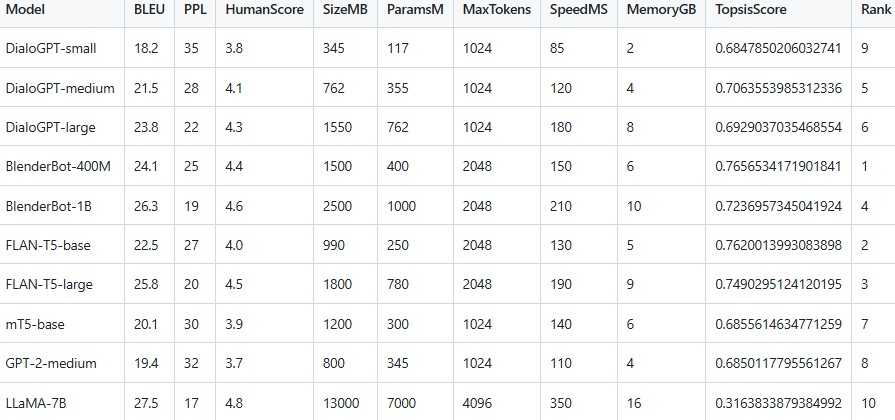

# TOPSIS for Pre-trained Text Conversational Models

This project is submitted as part of Assignment-5 (L3) for the course
UCS654.

Submitted by: Naman Kumar (102317229)

------------------------------------------------------------------------

## Objective

The objective of this assignment is to identify the best pre-trained
conversational model using the TOPSIS (Technique for Order Preference by
Similarity to Ideal Solution) method.

Multiple transformer-based conversational models were evaluated using
performance and efficiency criteria.

------------------------------------------------------------------------

## Models Evaluated

- DialoGPT-small
- DialoGPT-medium
- DialoGPT-large
- BlenderBot-400M
- BlenderBot-1B
- FLAN-T5-base
- FLAN-T5-large
- mT5-base
- GPT-2-medium
- LLaMA-7B

------------------------------------------------------------------------

## Decision Criteria

1.  BLEU Score (Benefit)
2.  Perplexity (Cost)
3.  Human Evaluation Score (Benefit)
4.  Model Size in MB (Cost)
5.  Number of Parameters (Cost)
6.  Maximum Tokens Supported (Benefit)
7.  Inference Speed in ms (Cost)
8.  Memory Requirement in GB (Cost)

Weights Used: 0.20, 0.15, 0.20, 0.10, 0.10, 0.10, 0.10, 0.05

Impacts: +,-,+,-,-,+,-,-

------------------------------------------------------------------------

## Methodology

TOPSIS follows these steps:

1.  Construct the decision matrix.

2.  Normalize the matrix using vector normalization.

3.  Multiply normalized matrix by weights.

4.  Determine ideal best and ideal worst solutions.

5.  Calculate Euclidean distance of each model from ideal best and
    worst.

6.  Compute TOPSIS score:

    Score = D- / (D+ + D-)

7.  Rank models based on descending TOPSIS score.

------------------------------------------------------------------------

## Result Table

------------------------------------------------------------------------

## Result Graph

The model with Rank = 1 is considered the most suitable conversational
model considering both quality and efficiency.

------------------------------------------------------------------------

## Conclusion

Based on TOPSIS analysis, the model ranked 1 demonstrates the best
balance between conversational performance (BLEU, Human Score) and
computational efficiency (size, speed, memory).

------------------------------------------------------------------------

## Files Included

-   data.csv
-   result.csv
-   ranking_plot.png
-   Topsis for Pretrained Models.ipynb
-   README.md
-   result_table.png
